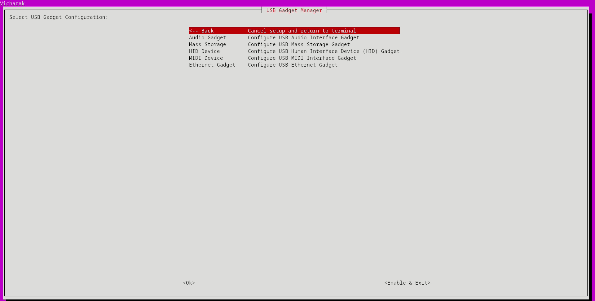

# USB Audio Gadget

The USB Audio Gadget feature allows a Linux device to function as an audio input/output device when connected to a host machine. This can be useful for testing audio playback and capture functionality directly from the Linux gadget device.

## 0. Kernel Requirements and Configuration

To use the USB Audio Gadget, your Linux kernel must be configured with specific options enabled for USB gadget functionality. Without these options, the kernel will not support the necessary drivers and modules to recognize and operate the USB Audio Gadget.

### Required Kernel Options

Make sure your kernel is compiled with the following configurations:

1. **USB Gadget Support**:
   Enable USB gadget support to allow your device to operate in peripheral (gadget) mode.
   ```plaintext
   CONFIG_USB_GADGET=y
   ```

2. **USB Gadget Function Drivers**:
   Enable USB Audio Class 2.0 driver support, which is essential for creating an audio gadget.
   ```plaintext
   CONFIG_USB_F_UAC2=y
   ```
   Optionally, if you require legacy USB Audio Class 1.0 support:
   ```plaintext
   CONFIG_USB_F_UAC1=y
   ```

3. **Composite USB Gadget**:
   To use multiple gadget functions (such as audio and mass storage), enable the composite framework:
   ```plaintext
   CONFIG_USB_CONFIGFS=y
   CONFIG_USB_CONFIGFS_F_UAC2=y
   ```

4. **Device Tree or Platform Configuration**:
   Ensure the USB controller on your hardware supports gadget mode. In some cases, this may involve setting parameters in the device tree (`*.dts`) file to specify that the USB port should operate as a peripheral (otg mode).


## 1. Enabling the USB Audio Gadget

You can enable the USB Audio Gadget either through a terminal user interface (TUI) or directly through the ConfigFS (configfs) filesystem.

### Enabling via TUI with USB Gadget Manager
The `usb-gadget-manager` utility program provides easy TUI-based configuration of Linux USB gadgets. Currently, it supports USB Audio and Mass Storage gadgets, with plans to add HID, Ethernet, MIDI, and Webcam support in upcoming releases.

#### Installation
1. **Install Dependencies**:
   ```bash
   sudo apt install ncurses whiptail
   ```
2. **Installation Options**:
   - **From Debian Package**:
     ```bash
     sudo apt install usb-gadget-manager
     ```
#### Enabling Audio Gadget Through TUI
1. Run `usb-gadget-manager` to launch the TUI.
2. Select the `Audio Gadget` from the menu.
3. Configure parameters such as sampling rate, channel configuration, and sample size.
4. Enable the gadget by saving your settings.

[](https://github.com/user-attachments/assets/446c40e0-e0b4-4f37-aaba-f9b8fee9f951)

### Enabling Directly Through ConfigFS
1. Create the necessary directory structure under `/sys/kernel/config/usb_gadget/`.
2. Set the attributes of the gadget, including `idVendor`, `idProduct`, and configurations for audio.
3. Bind the gadget to the appropriate UDC.

## 2. Detecting Proper Working Status

### Host Device (PC)
After connecting the USB Audio Gadget, the host should detect it as a USB audio input/output device.

#### On Linux:
1. Verify the new audio device by running:
   ```bash
   arecord -l
   aplay -l
   ```
   Example output:
   ```
   **** List of CAPTURE Hardware Devices ****
   card 0: PCH [HDA Intel PCH], device 0: ALC3246 Analog [ALC3246 Analog]
     Subdevices: 1/1
     Subdevice #0: subdevice #0
   card 1: Gadget [USB Gadget], device 0: USB Audio [USB Audio]
     Subdevices: 0/1
     Subdevice #0: subdevice #0
   ```

#### On Windows:
1. Open Device Manager to confirm that a USB audio device is recognized.
2. The audio device should also appear under `Sound settings`, allowing you to use it for both playback and recording.


### Gadget Device (Linux)
On the gadget device, verify that the audio gadget is active and capturing audio:
```bash
arecord -l
aplay -l
```

Example output:
```
**** List of CAPTURE Hardware Devices ****
card 4: rockchipes8388 [rockchip-es8388], device 0: dailink-multicodecs ES8323.3-0011-0 [dailink-multicodecs ES8323.3-0011-0]
  Subdevices: 1/1
  Subdevice #0: subdevice #0
card 5: UAC2Gadget [UAC2_Gadget], device 0: UAC2 PCM [UAC2 PCM]
  Subdevices: 0/1
  Subdevice #0: subdevice #0
```

## 3. Usage and Testing

### Linux: Testing Audio with `alsaloop` or `pactl`
To loop audio from the gadget to the hardware device, use `alsaloop` or `pactl`.

#### Using `alsaloop`:
```bash
sudo alsaloop -C hw:<usb_gadget_card> -P hw:<actual_sound_card>
```
Since `alsaloop` requires exclusive control of sound resources, it may conflict with other sound daemons like PulseAudio or PipeWire. If using `alsaloop`, consider stopping the daemon service:
```bash
sudo systemctl --user stop pulseaudio
```

#### Using `pactl`:
1. Set the USB Gadget as the audio output device  on *host device*:
   ```bash
   pactl list sinks short
   ```
   Example output:
   ```
   48	alsa_output.pci-0000_00_1f.3.analog-stereo	PipeWire	s32le 2ch 48000Hz	IDLE
   283	alsa_output.usb-Vicharak_USB_Gadget_5fdef992060a0a669b-00.analog-stereo	PipeWire	s16le 2ch 96000Hz	RUNNING
   ```
   
   Setting default sink (output) for *host device*:
   ```bash
   pactl set-default-sink 283
   ```

   You can also configure that from host device sound settings.

2. Configure the loopback module on the *gadget device*:
   ```bash
   pactl list sources short
   ```
   Example output:
   ```
    vicharak@vicharak:~$ pactl list sources short
   0	alsa_output.platform-dp0-sound.stereo-fallback.monitor	module-alsa-card.c	s16le 2ch 44100Hz	SUSPENDED
   1	alsa_output.platform-dp1-sound.stereo-fallback.monitor	module-alsa-card.c	s16le 2ch 44100Hz	SUSPENDED
   2	alsa_output.platform-es8388-sound.HiFi__hw_rockchipes8388__sink.monitor	module-alsa-card.c	s16le 2ch 48000Hz	SUSPENDED
   3	alsa_input.platform-es8388-sound.HiFi__hw_rockchipes8388__source	module-alsa-card.c	s16le 2ch 44100Hz	SUSPENDED
   6	alsa_output.platform-fc000000.usb.stereo-fallback.monitor	module-alsa-card.c	s16le 2ch 96000Hz	IDLE
   7	alsa_input.platform-fc000000.usb.stereo-fallback	module-alsa-card.c	s16le 2ch 96000Hz	RUNNING
   ```

   ```bash
   pactl list sinks short
   ```
   Example output:
   ```
   vicharak@vicharak:~$ pactl list sinks short
   2	alsa_output.platform-es8388-sound.HiFi__hw_rockchipes8388__sink	module-alsa-card.c	s16le 2ch 48000Hz	SUSPENDED
   4	alsa_output.platform-fc000000.usb.stereo-fallback	module-alsa-card.c	s16le 2ch 96000Hz	RUNNING
   ```
  
   Load the loopback module:
   ```bash
   pactl load-module module-loopback source=7 sink=2
   ```

   If everything is configured correctly, you will listen audio from gadget device when playing some audio on host device.

To remove the loaded loopback module:
```bash
pactl list modules short
pactl unload-module <module_id>
```

### Windows: Using Control Panel for Loopback (Recording)

1. Go to `Control Panel` > `Sound`.
2. Under the `Recording` tab, select the USB Audio device.
3. Use the loopback function in Windows to test the device as a recording source.

   [](https://github.com/user-attachments/assets/caf2925f-9e51-411e-a619-16bcf60c29c4)

5. Setting up the gadget device:

    ```bash
    pactl load-module module-loopback source=2 sink=4
    ```
    Now, play some audio on gadget device; if everything is configured correctly, you should hear audio through the Windows device.

  Alternatively, for setting up the gadget device as:
- **Microphone** (audio input):
  ```bash
  pactl load-module module-loopback source=3 sink=4
  ```
  This time, in the Windows device you will directly hear from microphone attached to the gadget device.
  
- **Speaker** (audio output):
  ```bash
  pactl load-module module-loopback source=7 sink=2
  ```
  In this configuration, you will hear from gadget device on playing some audio in Windows device. You will also need to select gadget device as audio output in Windows sound settings.


## 4. Miscellaneous Uses

The USB Audio Gadget can be used in various ways beyond simple testing:
- **Audio Streaming**: Stream audio data from the gadget to the host, useful in IoT or embedded audio applications.
- **Audio Processing**: Use the gadget as an audio input to perform real-time processing on the gadget device.
- **Testing and Diagnostics**: Simulate audio devices for testing and development purposes.

## 5. Special Notes

- **Configuration Compatibility**: Ensure that the configured sampling rate, channel count, and other parameters match the capabilities of both the host and gadget device.
- **Permissions**: Using `alsaloop` or `pactl` might require elevated permissions or specific configurations, especially if interacting with PipeWire or PulseAudio on the gadget device.
- **Troubleshooting**: If the gadget fails to be detected or malfunctions, rebooting the gadget device may resolve the issue.

